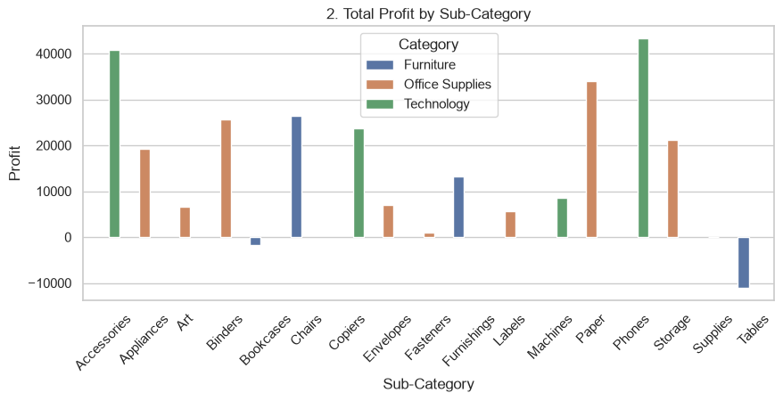
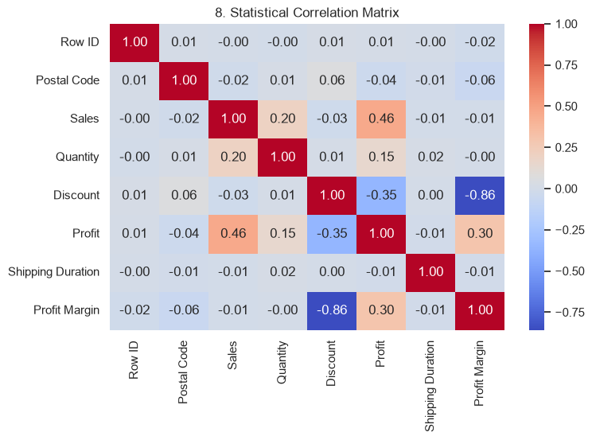

# Advanced Automated Analytical Pipeline - E-Commerce Sales 📊

## 📌 Project Overview
This project transitions ad-hoc manual data analysis into a robust, automated Python pipeline. Using an Object-Oriented Programming (OOP) approach, the pipeline automatically ingests raw e-commerce data, performs data cleaning, engineers new features, generates visualizations, and outputs an Executive KPI report.

## 🛠️ Tech Stack & Tools
- **Language**: Python
- **Libraries**: Pandas, NumPy, Matplotlib, Seaborn
- **Concepts**: Object-Oriented Programming (OOP), Feature Engineering, Exploratory Data Analysis (EDA), ETL.

## ⚙️ Pipeline Workflow (`SuperstorePipeline` Class)
1. **Data Ingestion & Memory Optimization**: Loads data securely with exception handling and downcasts numeric types for performance.
2. **Data Cleaning**: Automatically handles duplicates, missing values, and treats outliers in profitability.
3. **Feature Engineering**: Creates strategic business metrics including `Profit Margin`, `Shipping Duration`, and `Sales Performance Category`.
4. **Exploratory & Statistical Analysis**: Generates correlation matrices and distribution analyses.
5. **Automated Reporting**: Prints an instant Executive KPI summary (Total Revenue, Total Profit, Average Profit Margin, Total Orders) and exports the cleaned dataset.

---

## 📊 Visual Insights & Results

### 1. Total Profit by Sub-Category

  

### 2. Statistical Correlation Matrix

  

---

## 💡 Key Business Insights
* **Category Profitability**: Technology is the main driver of overall margins, while specific sub-categories like 'Tables' (Furniture) operate at a significant loss and require immediate pricing or inventory adjustments.
* **Discount Impact**: High discount levels show a strong negative correlation with profitability.
* **Seasonality**: Sales exhibit a strong upward trend toward Q4.

## 📂 Repository Structure
- `Advanced Automated Analytical Pipeline.ipynb`: The main notebook containing the OOP pipeline and execution code.
- `Data/`: Contains the final output data (`Cleaned_Superstore_Data_2.csv`).
- `Visualizations/`: Contains the generated charts (Sales Trends, Profitability by Sub-Category, Correlation Matrix, etc.).
